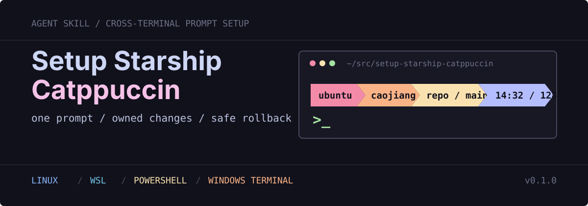

<p align="center">
  
</p>

<p align="center">
  <a href="https://github.com/CaoLiangqiang/setup-starship-catppuccin/releases/latest"></a>
  <a href="https://github.com/CaoLiangqiang/setup-starship-catppuccin/actions/workflows/validate.yml"></a>
  <a href="LICENSE"></a>
  
</p>

`setup-starship-catppuccin` is an Agent Skill that installs one consistent Starship prompt across Linux or WSL shells and the Windows host. It carries the exact Catppuccin Powerline configuration, CaskaydiaCove Nerd Fonts, deterministic installers, and rollback rules needed to reproduce the setup without replacing unrelated terminal settings. It also diagnoses host-specific Nerd Font failures in terminals such as Ghostty, Codex, Visual Studio Code, and Kiro without confusing them with shell initialization failures.

## Product and delivery model

The released product is a versioned GitHub-hosted Agent Skill, not a separate binary package. A release contains:

- `SKILL.md` and supporting references for audit, authorization, installation, repair, removal, and terminal-font diagnosis;
- deterministic Bash and PowerShell entry points for user-scoped managed state;
- one authoritative Starship preset and four checksum-pinned CaskaydiaCove Nerd Font files;
- isolated Linux and Windows fixtures plus GitHub Actions validation.

The scripts install Starship from its upstream installer or WinGet only when it is not already available. They retain the Starship executable or package during removal because package ownership may predate this Skill. Versioned Git tags and GitHub Releases are the distribution channel; project policy never moves a published tag or reuses a published version identifier. No npm, PyPI, container, or platform-specific binary artifact is published by this repository.

## See the target state first

The bundled prompt uses Catppuccin Mocha and keeps the information useful during everyday repository work:

```text
OS  user  ~/workspace/project  git:main +1  conda:env  14:32  128ms
>
```

It intentionally omits language and runtime versions. The visible segments are OS, username, directory, Git branch and status, Conda environment, time, command duration, and the final status character.

## Quick start

Install the stable `v0.2.0` release with the standard Agent Skills CLI:

```bash
npx skills add https://github.com/CaoLiangqiang/setup-starship-catppuccin/tree/v0.2.0 \
  --skill setup-starship-catppuccin
```

Use `CaoLiangqiang/setup-starship-catppuccin` without a tag only when you intentionally accept the repository's default branch at installation time.

Then ask Codex to use it:

```text
Use $setup-starship-catppuccin to audit my current terminal setup, then install
the Catppuccin Powerline prompt for WSL and Windows.
```

For direct, deterministic operation from the released checkout, audit before making changes:

```bash
git clone --branch v0.2.0 --depth 1 \
  https://github.com/CaoLiangqiang/setup-starship-catppuccin.git
cd setup-starship-catppuccin

bash scripts/configure-starship.sh --check
bash scripts/configure-starship.sh --install
```

Add `--with-windows` only when you also want to change Windows fonts, PowerShell profiles, and Windows Terminal:

```bash
bash scripts/configure-starship.sh --install --with-windows
```

Close every Windows Terminal window and start it again after a Windows installation so the process reloads the user PATH and font registry.

## What it manages

| Layer | Managed state |
| --- | --- |
| Linux / WSL | User-level Starship binary, `~/.config/starship.toml`, four bundled fonts, and owned Bash, Zsh, or Fish initialization blocks |
| Windows | User-scoped WinGet Starship package, PowerShell 5.1 and PowerShell 7 profiles, per-user fonts, and the Windows Terminal default font |
| Theme | Catppuccin Mocha Powerline layout with repository, environment, time, and command-status information |
| Integrity | Runtime verification of every bundled font against `assets/fonts/SHA256SUMS` before managed changes |
| Recovery | Fixed configuration backup, timestamped profile backups, content hashes, managed markers, collision checks, and targeted removal |

Windows Terminal must use the family name `CaskaydiaCove NF`. The longer name `CaskaydiaCove Nerd Font` is not the installed family name and causes the Terminal missing-font warning.

## Prompt works in one terminal but icons break in another?

If the prompt structure and colors are correct in Ghostty but symbols become boxes or blank cells in Codex, Visual Studio Code, or Kiro, Starship is probably already working. Each terminal host chooses its own font and does not inherit Ghostty's `font-family` setting.

Use the [terminal font troubleshooting guide](references/terminal-font-troubleshooting.md) to distinguish shell initialization failures from missing Nerd Font glyphs, discover the exact installed family name, configure each host, and validate the preset's symbols. The guide includes a verified `FiraCode Nerd Font Mono` macOS example, but the repository still bundles and manages CaskaydiaCove Nerd Font. It is manual guidance only; the installers do not configure those applications or make macOS release-qualified.

## Safety model

- `--check` is read-only and reports every `CHANGE NEEDED` item.
- Linux and WSL installation stays under the current user's home directory.
- Windows installation uses WinGet `--scope user` and the current-user font registry.
- Windows changes are separate and opt-in; the Linux installer never enables them silently.
- Install preflight validates bundled assets, target scope, owned state, profile collisions, and Windows Terminal settings before managed writes.
- Managed blocks have exact ownership markers. Foreign Starship initialization or malformed markers stop the operation.
- Removal restores the original Starship config only when the managed copy still matches its recorded hash.
- Windows font removal restores a pre-existing conflicting font file and its exact user registry value.
- Starship itself is retained during removal because it may have existed before this Skill.

The complete ownership, failure-recovery, and restart contract is documented in [platform behavior](references/platform-behavior.md).

## Choose the shell scope

Shell discovery covers Bash, Zsh, and Fish. Override it when a machine should manage only a specific set:

```bash
bash scripts/configure-starship.sh --install --shells bash,zsh
```

Windows can also be managed directly from Windows PowerShell 5.1 or PowerShell 7:

```powershell
.\scripts\configure-starship-windows.ps1 -Action Status
.\scripts\configure-starship-windows.ps1 -Action Install
```

## Roll back

Remove only state owned by this repository:

```bash
bash scripts/configure-starship.sh --remove
```

For Windows-only removal:

```powershell
.\scripts\configure-starship-windows.ps1 -Action Remove
```

If a managed config, font, profile block, or Terminal setting was edited after installation, removal stops instead of overwriting the newer user change.

## Repository map

```text
assets/fonts/          CaskaydiaCove Nerd Font files, OFL license, checksums
assets/starship/       Catppuccin Powerline configuration
scripts/               Linux/WSL and Windows installers
tests/                 Isolated idempotence, collision, and rollback fixtures
references/            Platform behavior and primary upstream sources
                       plus host-specific terminal-font troubleshooting
SKILL.md               Agent workflow, safety rules, and resource routing
```

## Validate a checkout

Run the Linux/WSL checks on a GNU/Linux host:

```bash
bash -n scripts/*.sh tests/*.sh
shellcheck -x scripts/*.sh tests/*.sh
bash tests/test-configure-starship.sh
(cd assets/fonts && sha256sum -c SHA256SUMS)
npx --yes skills@1.5.23 add . --list
```

When Codex's bundled `skill-creator` is available, also run its `quick_validate.py` against the checkout. This is an additional maintainer check, not a runtime dependency for consumers.

On Windows, parse the PowerShell sources and run:

```powershell
.\tests\test-configure-starship-windows.ps1
```

GitHub Actions runs the Linux and Windows validation paths for every push and pull request.

## Compatibility

- Linux and WSL: Bash 4 or newer on GNU/Linux, with Bash, Zsh, or Fish selected for prompt initialization; requires `curl`, GNU Coreutils, and standard user-level font discovery. `fc-cache` is used when available.
- Windows: Windows PowerShell 5.1 or PowerShell 7, WinGet, and Windows Terminal. Launch Windows Terminal once before installation so its user settings file exists.
- Font registration and Terminal configuration are Windows-user scoped; no UAC or machine-wide font installation is required.
- macOS automation is not release-qualified. Use the manual host-font diagnosis guide rather than the Linux installer.

## Sources and licenses

Installer behavior and bundled assets are tied to the primary sources listed in [references/sources.md](references/sources.md).

Repository scripts and documentation are released under the [MIT License](LICENSE). Bundled CaskaydiaCove font files remain under the [SIL Open Font License 1.1](assets/fonts/OFL.txt).
